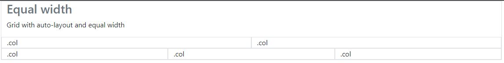

# This repo contains some useful information about Bootstrap 5 

## BREAKPOINTS

In bootstrap there are **6 default breakpoints**  

**Extra small: < 576px**  
**Small: >= 576px (sm)**  
**Medium: >= 768px (md)**
**Large: >= 992px (lg)**  
**Extra Large: >= 1200px (xl)**  

## Grid System

Bootstrap's grid system uses a series of containers, rows and columns to layout and align content.

### Columns

Bootstrap support until 12 columns, the column's number desired must be specified, otherwise this will be automatically adjust to the screen size.

**Equal width**  

To have columns with equal width just type col as a class, so for example the next chunk put 2 and 3 columns automatically.

```html
<div class="container border">
    <h3 class="component-variation text-muted">Equal width</h3>
    <p>Grid with auto-layout and equal width</p>
    <div class="row">
      <div class="col border">.col</div>
      <div class="col border">.col</div>
    </div>
    <div class="row">
      <div class="col border">.col</div>
      <div class="col border">.col</div>
      <div class="col border">.col</div>
    </div>
</div>     
```

The previous code, look like the following image.





**One column width**

A column can be set with a predefined width, one can predefine how many columns set in a row, but taking in account that the max of columns is 12, so for example the following chunk of code set the second column with 7, and the others two columns are adjust automatically, all depend of screen size.

```html
<div class="row">
<div class="col border">.col</div>
<div class="col-7 border">.col-7</div>
<div class="col border">.col</div>
</div>

```
The previous chunk of code looks like the following image


**Responsive**  
The columns can be setted to resize depending on the size screen, so for example the following code set 3 different possible values, the first one when the device is small, and it put until 12 columns, the second one is setted for medium device what is setted until 6 columns, and the last one which is setted to large devices.

```html
<div class="row">
    <div class="col-12 col-md-6 col-lg-3 border">.col-12 .col-md-6 .col-lg-3</div>
    <div class="col-12 col-md-6 col-lg-3 border">.col-12 .col-md-6 .col-lg-3</div>
    <div class="col-12 col-md-6 col-lg-3 border">.col-12 .col-md-6 .col-lg-3</div>
    <div class="col-12 col-md-6 col-lg-3 border">.col-12 .col-md-6 .col-lg-3</div>
</div>

```
The previous setup put one column until 768px that is when a medium size begins, then it will have 2 columns until get 992px that is when the larger size is taken.

The following screenshots shows the previous paragraph.

#### small size (until 768px)


#### Medium size (until 992px)


#### Large size (until 992px)


### CSS note

```css
div[class^="test"]{
    background: #fff;
```
The meaning of the previous notation is set a background to all divs which have a class name of test

## Vertical alignments

The columns can be align horizontally with the following 3 tags.

```html
<div class="row align-items-start"></div>
<div class="row align-items-center"></div>
<div class="row align-items-end"></div>
```

The previous 3 alignments look like the following images


## Horizontal alignment

There are 6 different to set the horizontal alignment with Bootstrap

The following chunk, shows the 6 tags available to set the horizontal alignments and how it looks like..

```html
<div class="row justify-content-start"></div>
```


```html
<div class="row justify-content-center"></div>
```


```html
<div class="row justify-content-end"></div>
```


```html
<div class="row justify-content-around"></div>
```


```html
<div class="row justify-content-between"></div>
```


```html
<div class="row justify-content-evenly"></div>
```


## Images

### Responsive images

Images in bootstrap are made responsive with  

``` html

```

## Forms

The tag to create a form is `<form>` and inside this tag is put label and input, label has normally a **for** and a **class**, and input also has **class** but also a type, placeholder (which is the name inside the writing field, and) and id the following piece of code shows a small form who has two labels and two inputs.


```html
<form>
    <fieldset>
      <div class="mb-3">
        <label for="inputEmail" class="form-label">Email input label</label>
        <input type="email" class="form-control" placeholder="Email input placeholder" id="inputEmail">
      </div>
      <div class="mb-3">
        <label for="inputPassword" class="form-label">Password input label</label>
        <input type="email" class="form-control" placeholder="Password input placeholder" id="inputPassword">
      </div>
      <button type="submit" class="btn btn-primary">Submit</button>
    </fieldset>
<form>
```


There is a way of place a text below the input box, this is useful to give information to the person who must fill up the form. Basically to add this helper you must write the attribute named `aria-describedby `  to the input, then add a `<p>` below with the id assigned to **aria-describedby**, the following example show that.


```html
<fieldset class="border">
  <div class="mb-3">
    <legend>Legend</legend>
    <label for="inputTextStacked" class="form-label">Text input label</label>
    <input type="text" class="form-control" placeholder="Text input placeholder" id="inputTextStacked" aria-describedby="inputTextStackedHelp">
    <p id="inputTextStackedHelp" class="form-text">Here goes the helper to fill the input</p>
  </div>
  <div class="mb-3">
    <label for="inputPassword" class="form-label">Password input label</label>
    <input type="email" class="form-control" placeholder="Password input placeholder" id="inputPassword" aria-describedby="inputPasswordHelper">
    <p id="" class="form-text">Here goes another helper but to the password</p>
  </div>
  <button type="submit" class="btn btn-primary">Submit</button>
</fieldset>

```


## Checks and radios

To create a radio is similar to create whatever form, its mean it must be typed input and label, but in **type** must be write "radio" and in **class** must be write form-check-input, the same applies to checkbox but in **type** must be write checkbox. The following example show us how to create a checkbox and a radio.

```html
<div class="form-check">
  <input type="checkbox" class="form-check-input" id="checkDefault1">
  <label class="form-check-label" for="checkDefault1">Default checkbox</label>
</div>

<div class="form-check">
  <input type="radio" class="form-check-input" id="checkDefault2">
  <label class="form-check-label" for="checkDefault2">Checked checkbox</label>
</div>

```


# Components

## Accordion

Accordion is a collapsible that is used to hide or show things.

An accordion has is made up by basically two parts, the first one is a div with the accordion class `<div class=accordion>`, and the second part is the tag which contains the items `<div class=accordion-item>`; but the accordion item is divided by also two parts, the accordion header `<div class="accordion-header">` and the accordion body `<div class="accordion-body">`.

The following chunk of code shows one accordion.

```html
<div class="accordion" id="accordionDefault">
  <div class="accordion-item">
    <h2 class="accordion-header" id="headingDefaultOne">
      <button type="button" class="accordion-button" data-bs-toggle="collapse" 
      data-bs-target="#collapseDefaultOne" aria-expanded="true" aria-controls="collapseDefaultOne">
      Accordion Item #1
      </button>
    </h2>
  <div id="collapseDefaultOne" class="accordion-collapse collapse show" aria-labelledby="headingDefaultOne"
   data-bs-parent="#accordionDefault">
    <div class="accordion-body">
      Lorem ipsum dolor sit amet, consectetur adipiscing elit. Vestibulum a velit sodales, 
      semper purus lacinia, venenatis diam. Sed erat sem, blandit ut purus id, ornare congue nunc. 
      Fusce nunc purus, luctus id fermentum at, semper ut ligula
  </div>
 </div>
</div>

```
The following shows the previous code rendered


